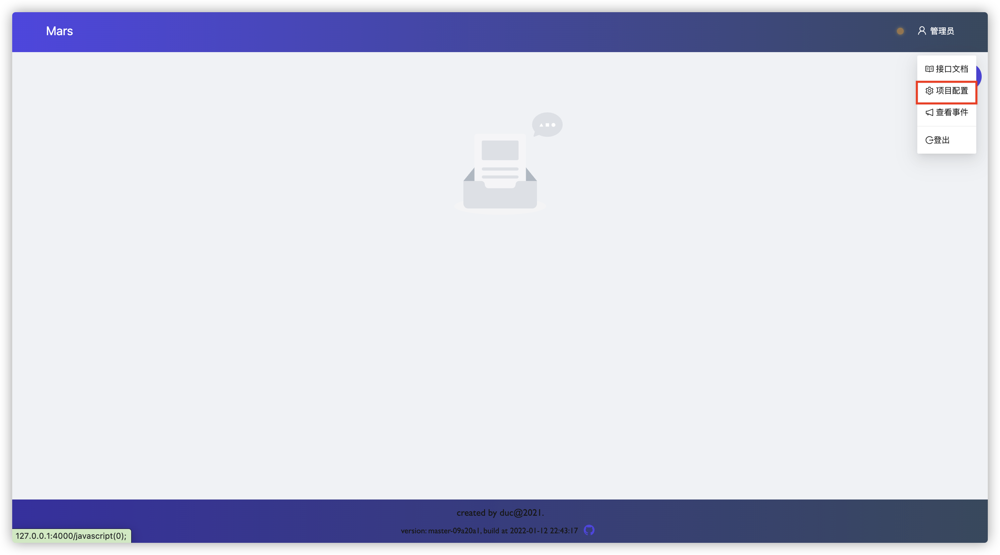

# 配置项目

## 全局配置（推荐）

登录到页面，点击 配置项目->开启项目->启用全局配置



首先配置 charts 目录

> 如果charts 就在项目目录下可以直接写相对路径
> 如果是引用别的的项目的charts，可以按照这个格式写 "项目id|项目分支|相对路径"


::: warning
配置完记得保存
:::

配好 charts 后保存，会自动加载默认 `values.yaml` 文件，这个只是给你参考用的，然后按照提示配置玩其他字段，其中 `values.yaml` , 有内置变量可以使用，配置完后大概长下面这样


## 按分支单独配置

用法借鉴 `.gitlab.yml`, 使用时只需要在项目下面创建一个 `.mars.yaml` 就可以了。

`.mars.yaml` 配置参考：

```yaml
# 项目默认的配置文件(可选)
config_file: config.yaml
# 默认配置, 必须用 '|', 全局配置文件，如果没有设置 config_file 则使用这个
config_file_values: |
  env: dev
  port: 8000
# 配置文件的类型(如果有config_file，必填)
config_file_type: yaml
# config_field 对应到 helm values.yaml 中的哪个字段(如果有config_file，必填)
# 可以使用 '->' 指向下一级, 比如：'config->app_name'， 会变成
# config:
#   app_name: xxxx
config_field: conf
# charts 文件在项目中存放的目录(必填), 也可以是别的项目的文件，格式为 "pid|branch|path"
local_chart_path: charts
# 是不是单字段的配置(如果有config_file，必填)
is_simple_env: false
# 若配置则只会显示配置的分支, 默认 "*"(可选)
branches:  - dev
  - master
# values_yaml 和 helm 的 values.yaml 用法一模一样，但是可以使用变量
# 目前支持的变量有，使用 `<>` 作为 Delim，避免和内置模板语法冲突
# `<.ImagePullSecrets>` `<.Branch>` `<.Commit>` `<.Pipeline>` `<.ClusterIssuer>`
# `<.Host1>...<.Host10>` `<.TlsSecret1>...<.TlsSecret10>`
values_yaml: |
  # Default values for charts.
  # This is a YAML-formatted file.
  # Declare variables to be passed into your templates.

  replicaCount: 1

  image:
    repository: xxx
    pullPolicy: IfNotPresent
    # Overrides the image tag whose default is the chart appVersion.
    tag: "<.Branch>-<.Pipeline>"

  imagePullSecrets: []
  nameOverride: ""
  fullnameOverride: ""

  ingress:
    enabled: false
    className: ""
    annotations: 
      kubernetes.io/ingress.class: nginx
      kubernetes.io/tls-acme: "true"
      cert-manager.io/cluster-issuer: "<.ClusterIssuer>"
    hosts:
      - host: <.Host1>
        paths:
          - path: /
            pathType: Prefix
    tls: 
      - secretName: <.TlsSecret1>
        hosts:
          - <.Host1>
```


### 📒 `is_simple_env`, `config_file` 解释

::: tip
使用全局配置无需关注这个
:::

这是一份普通的 helm charts values.yaml 文件

```yaml
# Default values for charts.
# This is a YAML-formatted file.
# Declare variables to be passed into your templates.

replicaCount: 1

image:  repository: nginx
  pullPolicy: IfNotPresent
  tag: ""

# ... 省略

# 你的 app 的 config 配置应该是这样的, 这个 `conf` 字段会被你用到其他地方比如 configmap、secret 等等
# 下面这个你的 is_simple_env 应该是 false，因为他们都是单独的变量
# config_file 字段的值是 `conf`
conf:  APP_PORT: 8080
  DB_HOST: mysql
  DB_PORT: 3306
#...

# 下面这个你的 is_simple_env 应该是 true，因为这部分配置是一个整体, config_file 字段的值是 `conf_two` 
conf_two: |
  APP_PORT: 8080
  DB_HOST: mysql
  DB_PORT: 3306
```

